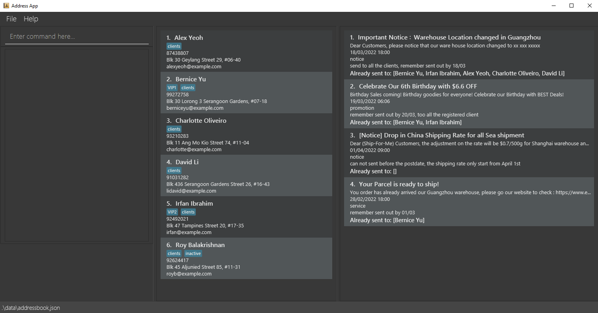

# GreatBook: A Grade Management App - for teachers to record and track students' scores

- **GreatBook** is an easy-to-use _(mainly CLI, with some GUI support)_ **Java / JavaFx Program**

### Useful links:
* [User Guide](docs/UserGuide.md)
* [Developer Guide](docs/DeveloperGuide.md)
* [About Us](docs/AboutUs.md)

Product Name: GreatBook

Brief Description of App:

A specialized grade management application (mainly CLI-based, with JavaFx GUI support) for teachers.
The app should help teachers to record, track and analyse students' scores easily and quickly.
We will add core features and continual updates to the project, to make it more useful for teachers to manage scores of class.