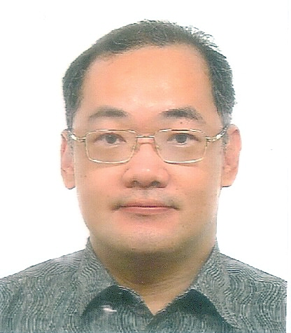
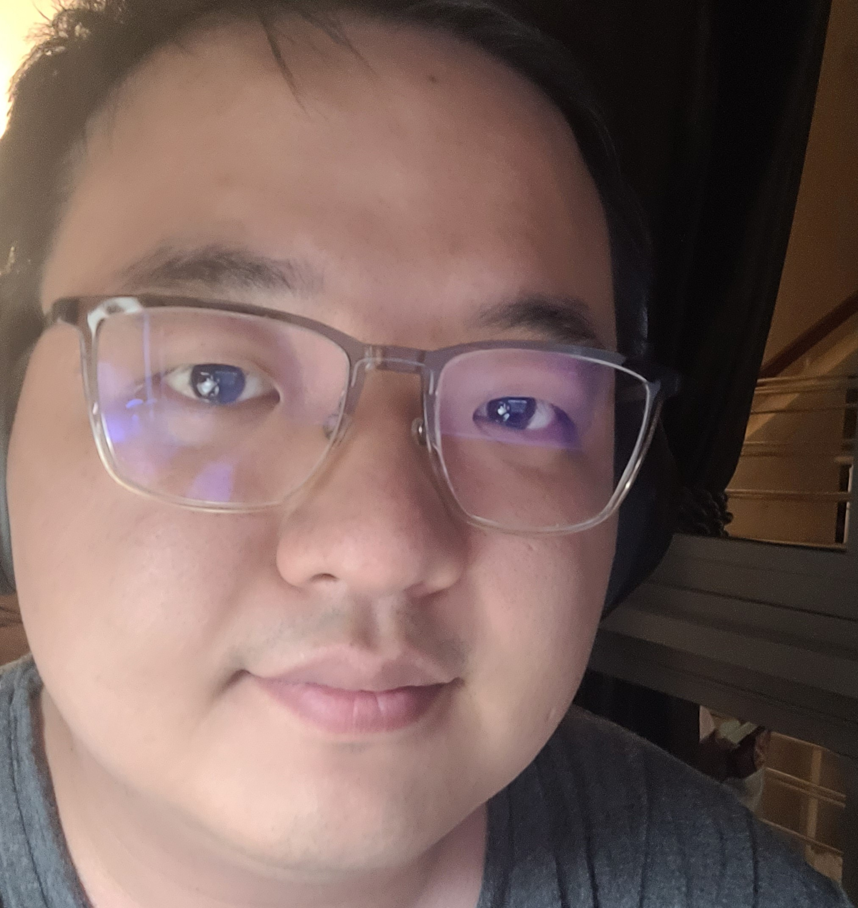
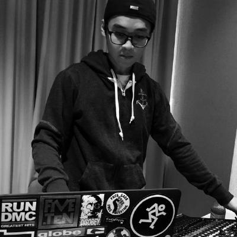

We are a final-year undergrad SE team of 2022, based in the [School of Computing, National University of Singapore](http://www.comp.nus.edu.sg).

You are welcome to browse our respective GitHub sites or connect with us by emails.

## Project team

### Gwee Yeu Chai

[[github](https://github.com/gweeyc)]
[[portfolio](team/gweeyc.md)]

* Role: Team Lead / Programmer
* Responsibilities: Admin + Log Command Code extensions + JavaFx Login Screen

### Low Yan Shuang

[[github](http://github.com/lowyanshuang)] [[portfolio](team/yanshuang.md)]

* Role: Developer
* Responsibilities: UI + Data

### Yang Shuogeng

[[github](https://github.com/YangShuogeng)]     
[[portfolio](team/yangshuogeng.md)]

* Role: Developer
* Responsibilities: Upgrade existing command + Add new command

### Tan Wei Hua

[[github](http://github.com/thisisdax)]
[[portfolio](team/thisisdax.md)]

* Role: Developer
* Responsibilities: Dev Ops + Threading

### James Doe

[[github](http://github.com/johndoe)]
[[portfolio](team/johndoe.md)]

* Role: Developer
* Responsibilities: UI
