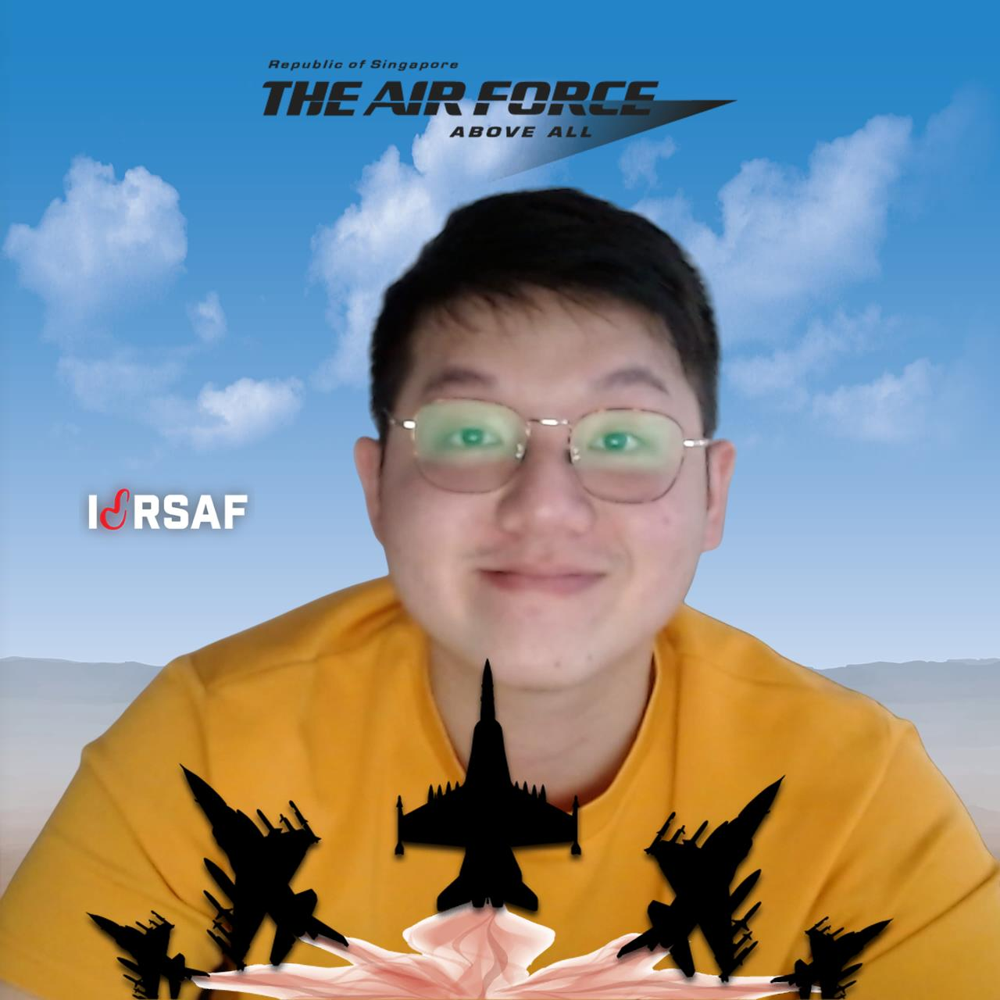
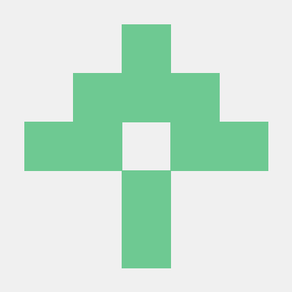

We are a team based in the [School of Computing, National University of Singapore](http://www.comp.nus.edu.sg).

You can reach us at the email `seer[at]comp.nus.edu.sg`

## Project team

### Khor Kee Yong

[[github](https://github.com/kaydenkhor)]
[[portfolio](team/kaydenkhor.md)]

* Role: Project Advisor

### Nie Ruiting

[[github](https://github.com/Ruiting1)]
[[portfolio](team/ruiting1.md)]

* Role: Developer
* Responsibilities: coding / UI / Documentation

### Tan Li Hao, Broderick

[[github](https://github.com/e0262191)]
[[portfolio](team/johndoe.md)]

* Role: Developer
* Responsibilities: Data

### Gimpaya Yralle Lesly John Caday

[[github](https://github.com/Mr-YaRou)]
[[portfolio](team/johndoe.md)]

* Role: Developer
* Responsibilities: Dev Ops + Threading

