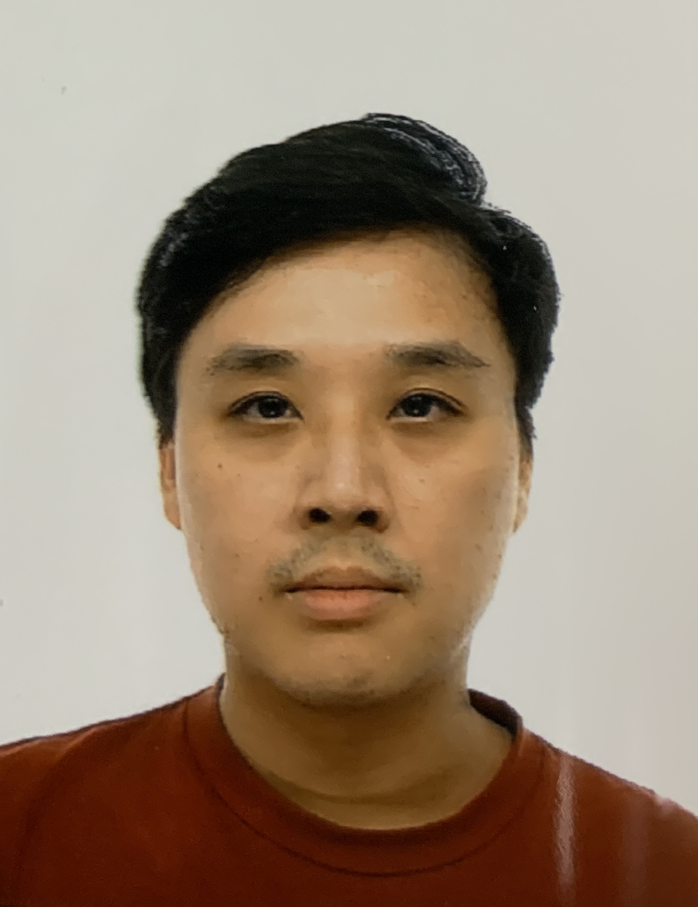

We are a team based in the [School of Computing, National University of Singapore](http://www.comp.nus.edu.sg).

You can reach us at the email `seer[at]comp.nus.edu.sg`

## Project team

### Zhang Yun

[[github](https://github.com/zyjarvis)]
[[portfolio](team/zhangyun.md)]

* Role: Project Advisor

### Joseph Guo Yang

[[github](http://github.com/badfr0g)]
[[portfolio](team/joseph.md)]

* Role: Developer

### Soh Weng Kit James

[[github](http://github.com/sohwkjames)] [[portfolio](team/james.md)]

* Role: Developer

### Jean Doe

[[github](http://github.com/johndoe)]
[[portfolio](team/james.md)]

* Role: Developer
* Responsibilities: Dev Ops + Threading
