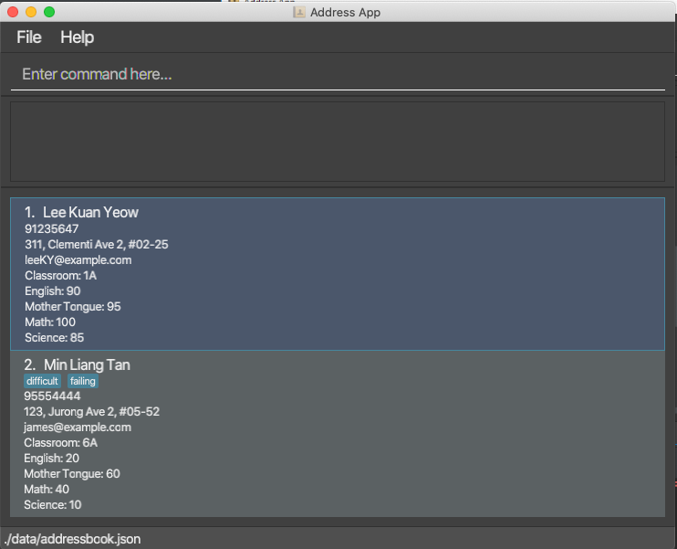

Project BUDDY is a Teacher’s Contact Management Application supported by CLI text input commands. Teachers can enter contact information for a swift search and retrieve desired contact information within a few keystrokes. The application provides an all-in-one display of the contacts related information and their details are presented in a beautiful scrolling view.

* Table of Contents
{:toc}

--------------------------------------------------------------------------------------------------------------------

## Quick start

1. Ensure you have Java `11` or above installed in your Computer.

1. Download the latest `projectbuddy.jar` from [here](https://github.com/AY2122S2-TIC4002-F18-3/tp2/releases).

1. Copy the file to the folder you want to use as the _home folder_ for your Project BUDDY.

1. Double-click the file to start the app. The GUI similar to the below should appear in a few seconds. Note how the app contains some sample data.<br>
   

1. Type the command in the command box and press Enter to execute it. e.g. typing **`help`** and pressing Enter will open the help window.<br>
   Some example commands you can try:

   * **`list`** : Lists all contacts.

   * **`add`**`n/John Doe p/98765432 e/johnd@example.com a/John street, block 123, #01-01` : Adds a contact named `John Doe` to the Address Book.

   * **`delete`**`3` : Deletes the 3rd contact shown in the current list.

   * **`clear`** : Deletes all contacts.

   * **`exit`** : Exits the app.

1. Refer to the [Features](#features) below for details of each command.

--------------------------------------------------------------------------------------------------------------------

## Command corresponding to Feature

<div markdown="block" class="alert alert-info">

**:information_source: Notes about the command format:**<br>

* Record people’s name, phone number, email and address:
  Format:      add n/NAME p/PHONE_NUMBER e/EMAIL a/ADDRESS
  Example:     add n/Duke p/98001234 e/duke@gmail.com a/Duke street, block 1, #05-01

</div>

### Viewing help : `help`

Shows a message explaning how to access the help page.


Format: `help`


### Adding a contact: `add`

Create a new contact with info such as name, hp, email, address and optional number of tags.

Format: `add n/NAME p/PHONE_NUMBER e/EMAIL a/ADDRESS [t/TAG]…​`

<div markdown="span" class="alert alert-primary">:bulb: **Tip:**
A person can have any number of tags (including 0)
</div>

Examples:
```
add n/Nana Park p/9666 4222 e/nana@example.com a/620 Bedok Rd, 470620 t/student t/G5-C02
```

### Delete a contact: `delete`

Format:      `delete SEQ_NO_OF_CONTACT`

+ SEQ_NO_OF_CONTACT refers to the numbering of the contact in the list.
+ SEQ_NO_OF_CONTACT must be a positive integer.

Example:
```
delete 2
```

### View a list of contacts: `list`

Format:      `list`
+ All contacts’ name, phone number, email and address will be displayed.

Example:
```
list
```

### Search contact by name: `find`

Format:      `find NAME`

+ NAME is case-insensitive. I.e. `find DUKE` will return `Duke`’s contact.
+ NAME has to be a full word. I.e. `find DUK` will not return `Duke`’s contact.
+ If NAME consists of two words, the sequence of words will not affect the search result. I.e. `find Duke John` will return both `John Duke`’s and `Duke John`’s contacts.
+ Contacts matching either one of the NAME will be returned. I.e. `find Duke John` will return both `Duke Mark` and `Charles Duke`’s contacts.

Example:
```
find Duke
```

### Exit the program:
Format:      `exit`
+ The contact list will not be deleted after exiting.

Example:
```
exit
```


--------------------------------------------------------------------------------------------------------------------

## FAQ

**Q**: How do I transfer my data to another Computer?<br>
**A**: Install the app in the other computer and overwrite the empty data file it creates with the file that contains the data of your previous AddressBook home folder.

--------------------------------------------------------------------------------------------------------------------

## Command summary

| Action     | Format, Examples                                                                                                                                                          |
|------------|---------------------------------------------------------------------------------------------------------------------------------------------------------------------------|
| **Add**    | `add n/NAME p/PHONE_NUMBER e/EMAIL a/ADDRESS [t/TAG]…​` <br> e.g. <br> `add n/James Ho p/22224444 e/jamesho@example.com a/123, Clementi Rd, 1234665 t/friend t/colleague` |
| **Delete** | `delete INDEX` <br> e.g. <br> `delete 2`                                                                                                                                  |
| **List**   | `list` <br> `list TAG` <br> e.g. <br> `list student`                                                                                                                      |
| **Fine**   | `find NAME` <br> e.g. <br> `find steve`                                                                                                                                   |
| **Exit**   | `exit`                                                                                                                                                                    |
