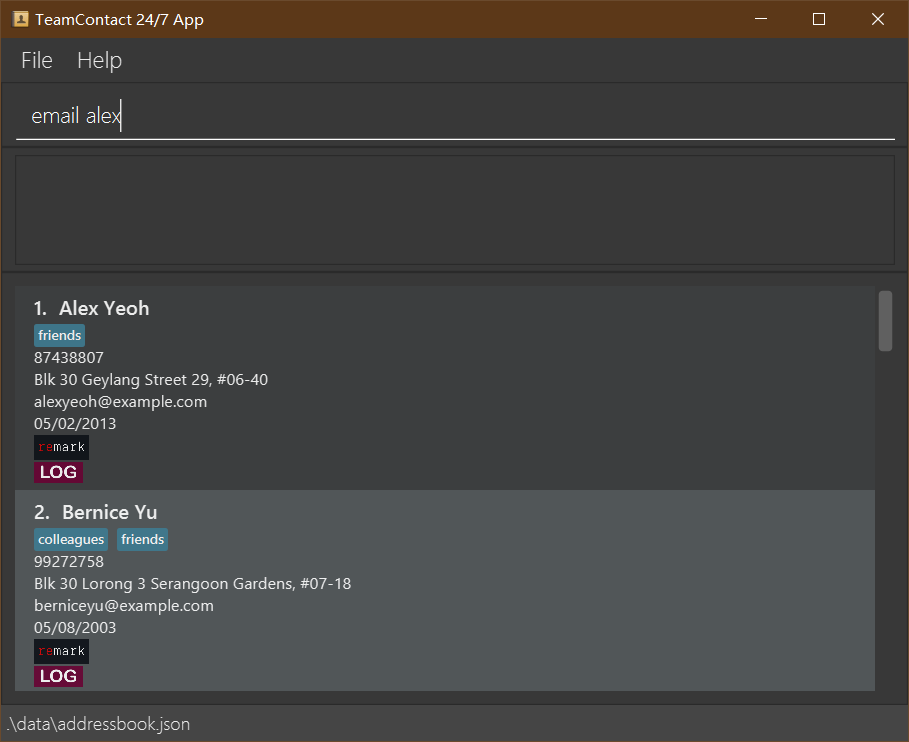
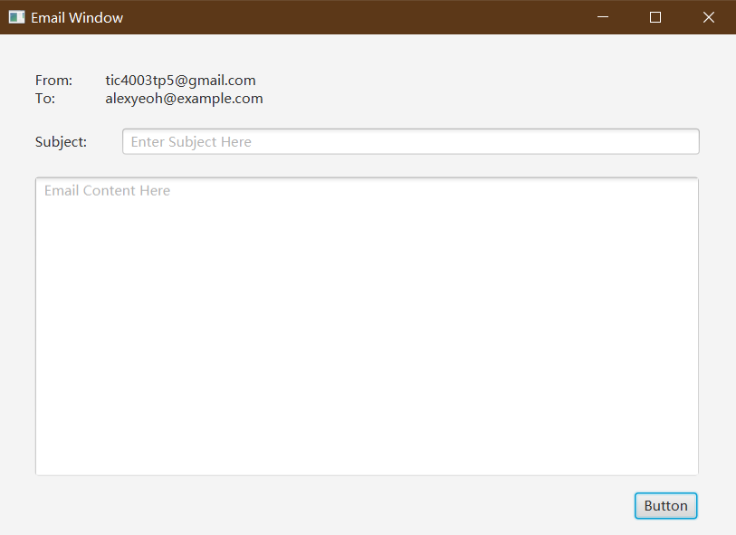
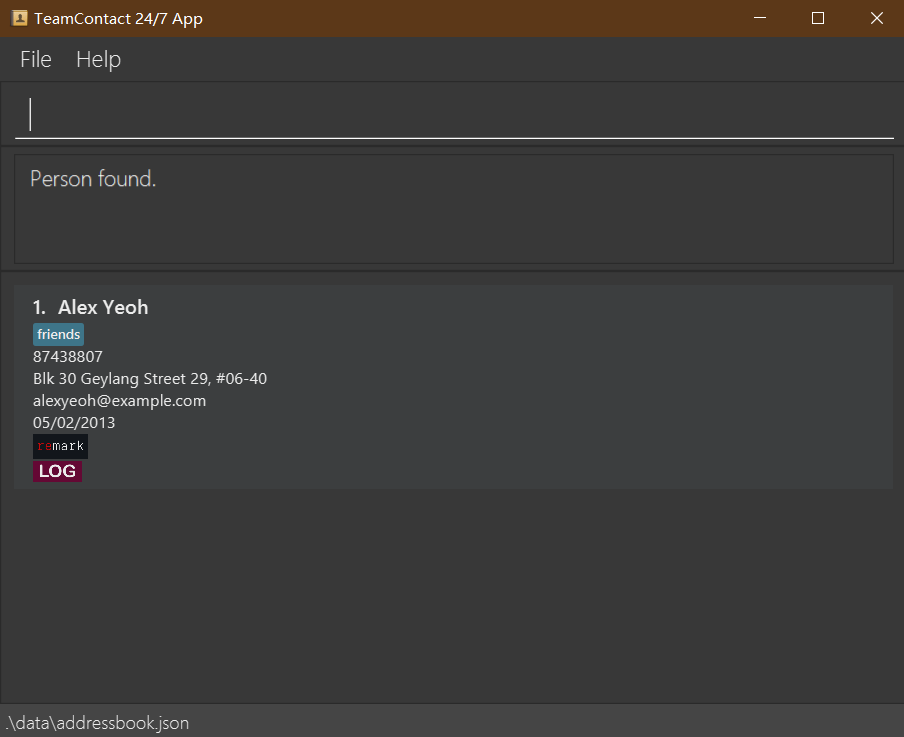

_**TeamContact 24/7**_ is a **desktop app for managing contacts, optimized for use via a Command Line Interface** (CLI) while still having the benefits of a Graphical User Interface (GUI). If you can type fast, TeamContact can get your contact management tasks done faster than traditional GUI apps.

--------------------------------------------------------------------------------------------------------------------

## Quick start

1. Ensure you have Java `11` or above installed in your Computer.

2. Download the latest `TeamContact 24-7-v1.4.jar` from the [tp2 Repo GitHub v1.4 release](https://github.com/AY2122S2-TIC4002-F18-5/tp2/releases/tag/v1.4).

3. Copy the file to the folder you want to use as the _home folder_ for your demo app.

4. Double-click the file to start the app. A Login Screen will appear.

5. Enter your login data (demo Username usage = "Java", sample Password usage = "123456").

7. The GUI similar to that shown below will appear next. Note how the app contains some sample data and a in-use CLI edit command. 
   

8. Type the command in the command box and press Enter to execute it. e.g. typing **`help`** and pressing Enter will open the help window. 
   Some example commands you can try:

   * **`list`** : Lists all contacts.

   * **`add`**`n/John Doe p/98765432 e/johnd@example.com a/John street, block 123, #01-01 d/09/08/2011 r/some comments g/male` : Adds a contact named `John Doe` to the TeamContact 24/7 app.
   
   * **`log`**`1 l/some brief communication note` : Logs a brief intercourse update on the 1st contact in the current display list.
     * _**NB:-** log is different from remark in the sense that log is for work-related notes only while remark is for all non work-related comments. A log is created via the log Command whereas remark is entered through the "r/" arg of add Command._
   * **`delete`**`3` : Deletes the 3rd contact shown in the current list.
   
   * **`sort`** : Sort all contacts.

   * **`clear`** : Deletes all contacts.

   * **`exit`** : Exits the app.

9. Refer to the [Features](#features) below for details of each command.

--------------------------------------------------------------------------------------------------------------------

## Features

**:information_source: Notes about the command format:** 

* Words in `UPPER_CASE` are the parameters to be supplied by the user. 
  e.g. in `add n/NAME`, `NAME` is a parameter which can be used as `add n/John Doe`.

* Items in square brackets are optional. 
  e.g `n/NAME [t/TAG]` can be used as `n/John Doe t/friend` or as `n/John Doe`.

* Items with `…`​ after them can be used multiple times including zero times. 
  e.g. `[t/TAG]…​` can be used as ` ` (i.e. 0 times), `t/friend`, `t/friend t/family` etc.

* Parameters can be in any order. 
  e.g. if the command specifies `n/NAME p/PHONE_NUMBER`, `p/PHONE_NUMBER n/NAME` is also acceptable.

* If a parameter is expected only once in the command but you specified it multiple times, only the last occurrence of the parameter will be taken. 
  e.g. if you specify `p/12341234 p/56785678`, only `p/56785678` will be taken.

* Extraneous parameters for commands that do not take in parameters (such as `help`, `list`, `exit` and `clear`) will be ignored. 
  e.g. if the command specifies `help 123`, it will be interpreted as `help`.

### Viewing help : `help`

Shows a message explaning how to access the help page.

Format: `help`

### Adding a person: `add`

Adds a person to TeamContact 24/7 app.

Format: `add n/NAME p/PHONE_NUMBER e/EMAIL a/ADDRESS d/DATE_JOINED r/REMARK g/GENDER [t/TAG]…​`

:bulb: **Tip:**
A person can have any number of tags (including 0)

Examples:
* `add n/John Doe p/98765432 e/johnd@example.com a/John street, block 123, #01-01 d/09/01/2022 r/some comments g/male`
* `add n/Betsy Crowe t/friend e/betsycrowe@example.com a/Newgate Prison p/1234567 d/09/01/2022 r/some comments t/criminal g/female`

### Logging a brief project work note or communication update : `log`

Logs a brief project work related memo / intercourse update on a person listed in the TeamContact 24/7 app.

Format: `log INDEX l/Some brief log note on the contact`

* Logs a project work brief on the person at the specified `INDEX`. The index refers to the index number shown in the displayed person list. The index **must be a positive integer** 1, 2, 3, …​
* Command format must be strictly adhered to, else invalid format exception will be shown instead.
* Existing values will be updated to the input values.
* When entering a log note, the existing log of the person will be removed i.e. adding of logs is not cumulative.
* You can remove a person’s log note by typing `l/` without
  specifying any tags after it.

Examples:
*  `log 1 l/John informed of Sprint Exercise 01 closure: 3pm YDA.` Logs a communication done the day before with the 1st person.
*  `log 2 l/to hold meeting with Sponsor Dave: 2pm Fri.` Logs a pending meeting with the 2nd person on display list and clear previous log if it exists.

### Listing all persons : `list`

Shows a list of all persons in TeamContact 24/7 app.

Format: `list`

### Editing a person : `edit`

Edits an existing person in TeamContact 24/7 app.

Format: `edit INDEX [n/NAME] [p/PHONE] [e/EMAIL] [a/ADDRESS] [d/DATE_JOINED] [r/REMARK] [g/GENDER] [t/TAG]…​`

* Edits the person at the specified `INDEX`. The index refers to the index number shown in the displayed person list. The index **must be a positive integer** 1, 2, 3, …​
* At least one of the optional fields must be provided.
* Existing values will be updated to the input values.
* When editing tags, the existing tags of the person will be removed i.e adding of tags is not cumulative.
* You can remove all the person’s tags by typing `t/` without
    specifying any tags after it.

Examples:
*  `edit 1 p/91234567 e/johndoe@example.com` Edits the phone number and email address of the 1st person to be `91234567` and `johndoe@example.com` respectively.
*  `edit 2 n/Betsy Crower t/` Edits the name of the 2nd person to be `Betsy Crower` and clears all existing tags.

### Locating persons by name: `find`

Finds persons whose names contain any of the given keywords.

Format: `find KEYWORD [MORE_KEYWORDS]`

* The search is case-insensitive. e.g `hans` will match `Hans`
* The order of the keywords does not matter. e.g. `Hans Bo` will match `Bo Hans`
* Only the name is searched.
* Only full words will be matched e.g. `Han` will not match `Hans`
* Persons matching at least one keyword will be returned (i.e. `OR` search).
  e.g. `Hans Bo` will return `Hans Gruber`, `Bo Yang`

Examples:
* `find John` returns `john` and `John Doe`
* `find alex david` returns `Alex Yeoh`, `David Li` 
  

### Deleting a person : `delete`

Deletes the specified person from TeamContact 24/7 app.

Format: `delete INDEX`

* Deletes the person at the specified `INDEX`.
* The index refers to the index number shown in the displayed person list.
* The index **must be a positive integer** 1, 2, 3, …​

Examples:
* `list` followed by `delete 2` deletes the 2nd person in the app.
* `find Betsy` followed by `delete 1` deletes the 1st person in the results of the `find` command.

### Email a person : `email` 

Examples:

* Send email to `Alex Yeoh` --> Key in `email yeoh` as shown below:

* If the name can be found in the list, an email window will be showed as shown below:

* In the main window, the selected contact person's details will be shown as shown below:

### Restore a previous entry : `undo`
 
Restores the previous address book state from its history

Format: `undo`

### Restore a previously undone entry : `redo`

Restores a previously undone address book state from its history.

Format: `redo`

### Sort by name : `sort`

Sort all contacts by name in ascending order

Format: `sort`

### Clearing all entries : `clear`

Clears all entries from TeamContact 24/7 app.

Format: `clear`

### Exiting the program : `exit`

Exits the program.

Format: `exit`

### Saving the data

The application data are saved in the hard disk automatically after any command that changes the data. There is no need to save manually.

### Editing the data file

Program data are saved as a JSON file `[JAR file location]/data/addressbook.json`. Advanced users are welcome to update data directly by editing that data file.

:exclamation: **Caution:**
If your changes to the data file makes its format invalid, TeamContact 24/7 app will discard all data and start with an empty data file at the next run.

### Securing the data file

The offline addressbook.json file is not encrypted by any means, it is visually exposed to public viewing,
so possibly running afoul of PDPA violation or subterfuge if fallen into the wrong hand.

We leave it to the user how he/she will want to personally configure or implement the encryption/decryption mechanism part where
the TeamContact 24/7 will save log, data and setting files in the current working folder, e.g. Windows user can use the
native Bitlocker or Explorer file/folder encryption features easily, or choose a third party tool like
[Easy File Locker](https://xoslab.com/efl.html) or [7-zip](https://7ziphelp.com/password-protect-on-7zip) to give
confidentiality to the folder, or a concerned file.

### Archiving data files `[coming in v2.0]`

_Details coming soon ..._

--------------------------------------------------------------------------------------------------------------------

## FAQ

**Q**: How do I transfer my data to another Computer? 
**A**: Install the app in the other computer and overwrite the empty data file it creates with the file that contains the data of your previous program home folder.

--------------------------------------------------------------------------------------------------------------------

## Command summary

| Action     | Format, Examples                                                                                                                                                                                                 |
|------------|------------------------------------------------------------------------------------------------------------------------------------------------------------------------------------------------------------------|
| **Add**    | `add n/NAME p/PHONE_NUMBER e/EMAIL a/ADDRESS d/DATE_JOINED r/REMARKS [t/TAG]…​`   e.g., `add n/James Ho p/22224444 e/jamesho@example.com a/123, Clementi Rd, 1234665 d/09/01/2021 r/gay t/friend t/colleague` |
| **Log**    | `log INDEX l/note or intercourse update`   e.g., `log 5 l/talked with Team Lead on 1 more coder for Sprint Exercise 2`                                                                                        |
| **Clear**  | `clear`                                                                                                                                                                                                          |
| **Delete** | `delete INDEX`  e.g., `delete 3`                                                                                                                                                                              |
| **Edit**   | `edit INDEX [n/NAME] [p/PHONE_NUMBER] [e/EMAIL] [a/ADDRESS] [d/DATE_JOINED] [r/REMARKS] [g/GENDER] [t/TAG]…​`  e.g.,`edit 2 n/James Lee e/jameslee@example.com`                                               |
| **Find**   | `find KEYWORD [MORE_KEYWORDS]`  e.g., `find James Jake`                                                                                                                                                       |
| **Sort**   | `sort`                                                                                                                                                                                                           |
| **List**   | `list`                                                                                                                                                                                                           |
| **Help**   | `help`                                                                                                                                                                                                           |
